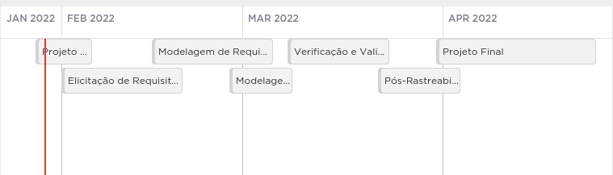
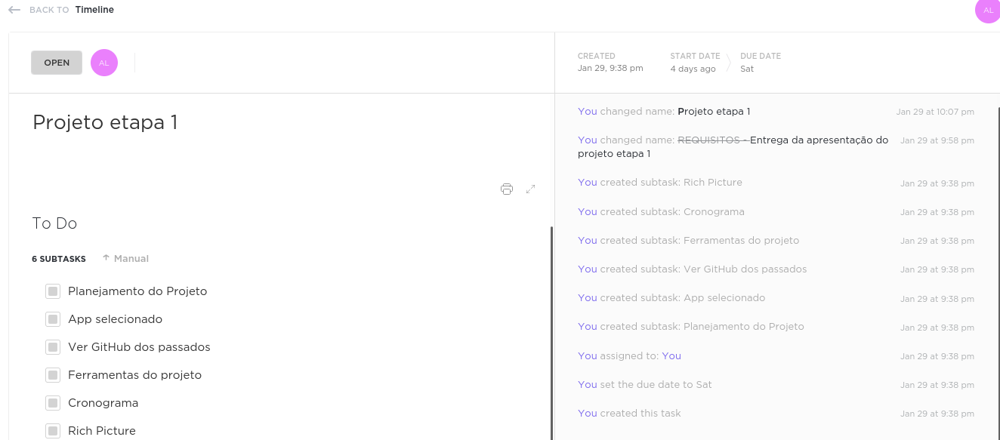
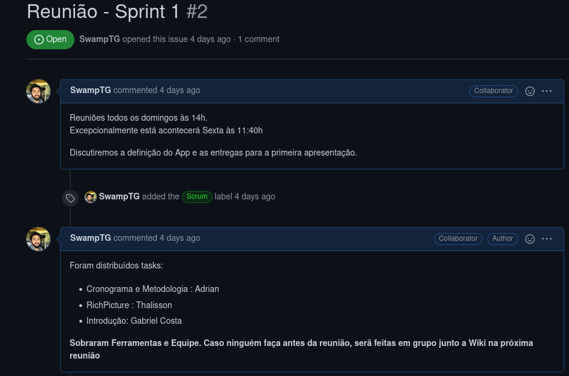

# Planejamento

## Cronograma

O cronograma foi orientado pelas próprias entregas da disciplinas e constará na sprint dedicada a cada atividade, colocaremos os responsáveis pelas issues e seus respectivos revisores. O cronograma poderá ser modificado ao longo do projeto, pois artefatos podem ser evoluídos e modificados. Além disso, novos contextos podem surgir.

**Clique [aqui](https://sharing.clickup.com/tl/h/6-168993937-16/759abf0db6a9492) para ver o quadro totalmente**

> Ao clicar em uma das entradas do calendário, podemos visualizar os detalhes de entrega e os prazos:

> Nós utilizaremos as issues do GitHub para atribuir tasks para cada um e os prazos de entrega de cada task

## Histórico de Versão

| Versão |   Data   |     Alteração      | Responsável |  Revisão   |
| :----: | :------: | :----------------: | :---------: | :--------: |
| 0.0.1  | 29/01/22 |      Criação       |   Adrian    |  Fernando  |
| 0.0.1  | 29/01/22 | Revisão gramatical |   Adrian    | João Durso |
