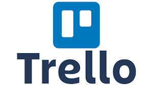

	

		

			
			
O Discord será utilizado para a realização de reuniões e do Sprint planning.

		

        

			
			
O Github será utilizado como repositório dos documentos produzidos e para o versionamento dos mesmos.

		

        

			
			
O LucidCharts será utilizado para a criação dos diversos diagramas e esquemas necessários para a modelagem dos Requisitos

		

	

	

			

				
				
O Telegram será utilizado para a comunicação mais ágil e constante do grupo.

			

			

				
				
O Trello será utilizado para a organização e planejamento do grupo, controlando as datas de entrega de artefatos e apresentações.

			

	

