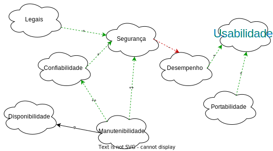

# NFR - Framework

## 1. Introdução

## 2. Metodologia

## 3. NFR

<!-- 

    

        

            
        

    

-->

### 3.1. NFR GERAL

    

        

            
        

    

## 4. Conclusão

## Referências bibliográficas

> Silva, F. D.; Souza, M.; (2000) Nome do Livro. Editora. Edição

## Histórico de versões

Versão|Data|Alteração|Responsável|Revisão|
:-:|:-:|:-:|:-:|:-:|
0.0.1|29/01/22|Criação|Adrian|Fernando|

