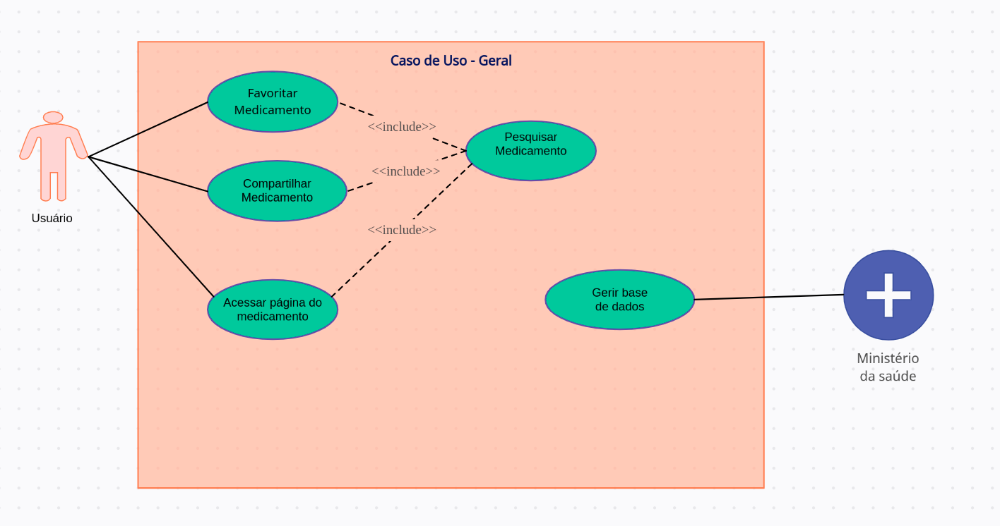

# Cenários

## 1. Introdução

A modelagem de caso de uso é uma abstração do sistema baseado em ações do usuário, ou seja, mostram como o sistema
deve se comportar com um determinado conjunto de ações.  Deste modo, os casos de uso que tem como objetivo não só ajudar
a extrair os requisitos, como também documentar o sistema. 

Isso significa que, durante o processo de elicitação essa modelagem pode ser usada com foco de discussão com os stakeholders, 
desta forma, deve possuir uma linguagem simples, natural e intuitiva. 

Além disso, durante a fase de projeto, são usados para descrever o sistema para os engenheiros que o implementam. 

## 2. Metodologia

Para a criação de desse artefato escolhemos a abordagem tradicional, ou seja, representar os casos de uso através um diagrama UML.
A ferramenta escolhida para criar essa representação foi o creately. Além disso, o grupo teve como referência o resultado da elicitação e os 
cenários para a criação desse artefato.  

## 3. Casos de Uso
### UC00 - título
|UC00|Descrição|
|       :-:                   |--|
|Descrição        |Uma breve descrição |
|Ator             |São entidades externas ao sistema que participam de um ou mais casos de uso normalmente ou fornecem eventos de entrada ou recebem alguma resposta do sistema.|
|Pré-condições    |é o estado do sistema e de seus arredores que é necessário para que o caso de uso possa ser iniciado|
|Fluxo Principal  |descreve a funcionalidade principal do caso de uso, quando nenhum desvio é tomado   |
|Fluxo Alternativo|especificam interações alternativas com a mesma meta.|
|Pós-condições    |As Pós-Condições são os estados que o sistema pode ficar depois do caso de uso terminar   |
|Rastreabilidade  ||

<!-- link dos para ediar os casos https://app.creately.com/d/Qv2g5exxYgb/edit -->
###Caso de Uso - Geral
 

  

###UC01 - Título
|UC00|Descrição|
|       :-:                   |--|
|Descrição        ||
|Ator             ||
|Pré-condições    ||
|Fluxo Principal  ||
|Fluxo Alternativo||
|Pós-condições    ||
|Rastreabilidade  ||

## Referências bibliográficas

https://www.cin.ufpe.br/~rls2/processo_tg/Metodologia%20S&B/guidances/concepts/use_case_8F95459C.html#:~:text=Uma%20precondi%C3%A7%C3%A3o%20%C3%A9%20o%20estado,do%20caso%20de%20uso%20terminar.

## Histórico de versões

| Versão  |   Data   |                        Alteração                         | Responsável   |    Revisão    |
| :-----: | :------: | :------------------------------------------------------: | :---------:   | :-----------: |
|  0.0.1  | 05/03/22 |                         Criação                          | Gabriel Costa |         |
