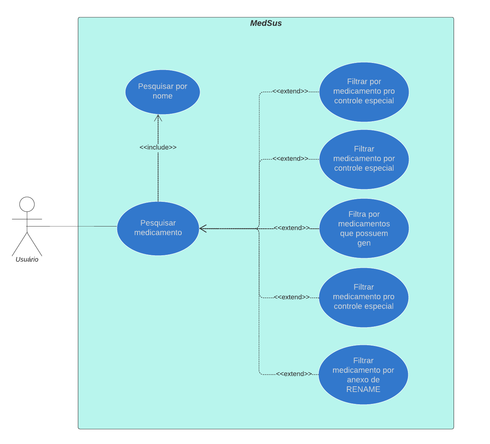
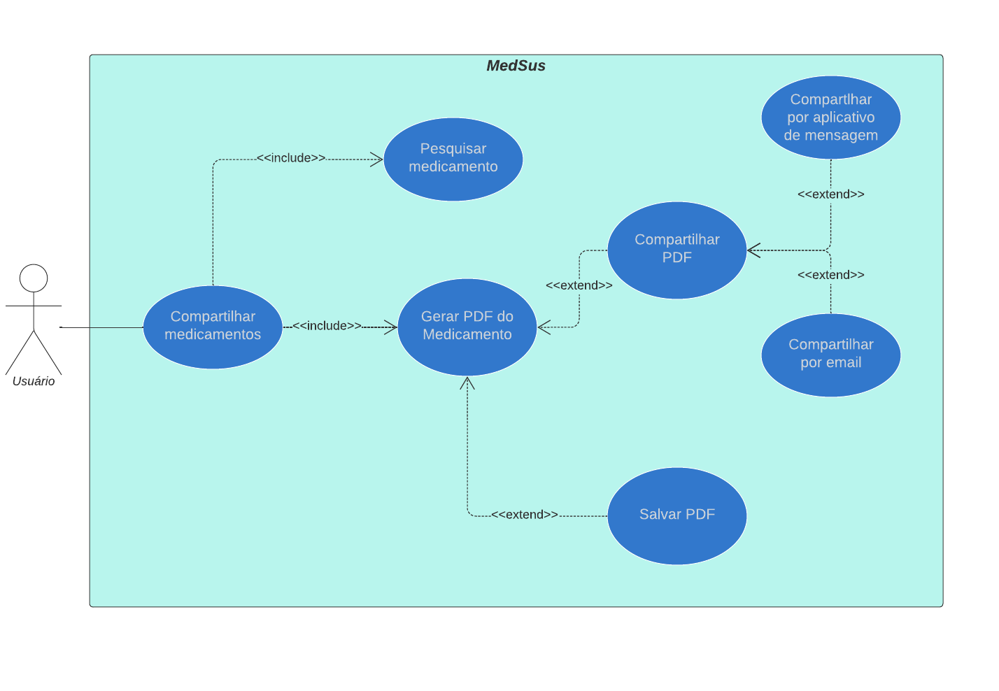

# Caso de uso

#### 1. Introdução

A modelagem de caso de uso é uma abstração do sistema baseado em ações do usuário, ou seja, mostram como o sistema
deve se comportar com um determinado conjunto de ações.  Deste modo, os casos de uso que tem como objetivo não só ajudar
a extrair os requisitos, como também documentar o sistema. 

Isso significa que, durante o processo de elicitação essa modelagem pode ser usada com foco de discussão com os stakeholders, 
desta forma, deve possuir uma linguagem simples, natural e intuitiva. 

Além disso, durante a fase de projeto, são usados para descrever o sistema para os engenheiros que o implementam. 

#### 2. Metodologia

Para a criação de desse artefato escolhemos a abordagem tradicional, ou seja, representar os casos de uso através um diagrama UML.
A ferramenta escolhida para criar essa representação foi o lucidchart. Além disso, o grupo teve como referência o resultado da elicitação e os 
cenários para a criação desse artefato.  

##2.1 Tamplete 

### UCxx - título
|UC00|Descrição|
|       :-:                   |--|
|Descrição        |Uma breve descrição |
|Ator             |São entidades externas ao sistema que participam de um ou mais casos de uso normalmente ou fornecem eventos de entrada ou recebem alguma resposta do sistema.|
|Pré-condições    |é o estado do sistema e de seus arredores que é necessário para que o caso de uso possa ser iniciado|
|Fluxo Principal  |descreve a funcionalidade principal do caso de uso, quando nenhum desvio é tomado   |
|Fluxo Alternativo|especificam interações alternativas com a mesma meta.|
|Pós-condições    |As Pós-Condições são os estados que o sistema pode ficar depois do caso de uso terminar   |
|Rastreabilidade    | rastreabilidade dos requisitos |

## 2.2 Legenda dos Relacionamentos

Na UML, relacionamentos identificam as ligações semânticas que existem entre elementos de modelo.

| relacionamentos          | descrição |
| --------      | -------- |
| Associação | Uma linha sólida não orientada entre atores e casos de uso. Demonstra que o Ator utiliza a função do sistema representada pelo Caso de Uso .|
|  << include >>  |permitir a reutilização de um determinado comportamento de um caso de uso por outros casos de uso, funções com relacionamento include sempre são execultadas. |
|  << extend >>  | Um relacionamento de extend é usado para mostrar um comportamento opcional, comportamento que somente é executado sobre determinadas condições. |

#### 3. Casos de Uso
### UC00 - Caso de Uso Geral

<h6 style="text-align:center">Figura 1: Caso de Uso Geral</h6>
<h6 style="text-align: center">Fonte: Autor</h6>

### UC01 - Pesquisa de Medicamento

<h6 style="text-align:center">Figura 2: Pesquisar Medicamento</h6>
<h6 style="text-align: center">Fonte: Autor</h6>
 

|UC01|Descrição|
|       :-:                   |--|
|Descrição        |O usuário pesquisa por um medicamento   |
|Ator             |todos|
|Pré-condições    |Celular com acesso à internet e com o aplicativo instalado   |
|Fluxo Principal  | >  O usuário entra na secção de pesquisa   > Seleciona ou não alguns filtros para a sua pesquisa     > Digita um nome de medicamento   > Confirma a pesquisa |
|Fluxo Alternativo|Caso nenhum remédio seja encontrado o sistema avisa que a busca não obteve resultado  |
|Pós-condições    |O aplicativo continua na tela de pesquisa ou entre na página de um medicamento se algum for selecionado|
|Rastreabilidade    | ST04 ST09 IR9 |

### UC02 - Visualizar Medicamento

<h6 style="text-align:center">Figura 3: Visualizar Medicamento</h6>
<h6 style="text-align: center">Fonte: Autor</h6>

|UC02|Descrição|
|       :-:                   |--|
|Descrição        | O usuário escolhe as informações que deseja visualizar |
|Ator             |todos|
|Pré-condições    | Pesquisar o medicamento |
|Fluxo Principal  | > Entrar na página do medicamento   >  escolher o tipo de informação ( para leigos ou para usuários avançados )|
|Fluxo Alternativo| não se aplica |
|Pós-condições    | O aplicativo continua na página de visualização do medicamento |
|Rastreabilidade    | ST12 IR1 ST11 |

### UC03 - Compartilhar Medicamento

<h6 style="text-align:center">Figura 4: Compartilhar Medicamento</h6>
<h6 style="text-align: center">Fonte: Autor</h6>

|UC03|Descrição|
|       :-:                   |--|
|Descrição        | O usuário compartilha um medicamento em formato PDF|
|Ator             |todos|
|Pré-condições    | Pesquisar o medicamento |
|Fluxo Principal  | > Entrar na página do medicamento   > Escolher um aplicativo para exportar o PDF   |
|Fluxo Alternativo| não se aplica |
|Pós-condições    | O aplicativo continua na página de visualização do medicamento |
|Rastreabilidade    | ST08 ST09 |

#### 4. conclusão

O diagrama de caso de uso é uma ótima maneira de modelar os requisitos levantados. Os artefatos produzidos aqui serão usados não só como foco de discussão para a criação de outros artefatos, mas também como referência dos relacionamentos dos requisitos.

## Referências bibliográficas

- CASO de Uso. [S. l.], 2021. Disponível em: https://www.cin.ufpe.br/~rls2/processo_tg/Metodologia%20S&B/guidances/concepts/use_case_8F95459C.html#:~:text=Uma%20precondi%C3%A7%C3%A3o%20%C3%A9%20o%20estado,do%20caso%20de%20uso%20terminar. Acesso em: 3 abr. 2022.

- ESPECIFICANDO Relacionamentos em Diagramas. [S. l.], 2021. Disponível em: https://www.ibm.com/docs/pt-br/rsm/7.5.0?topic=diagrams-specifying-relationships-in. Acesso em: 3 abr. 2022.

- DIAGRAMA de caso de uso UML: O que é, como fazer e exemplos. [S. l.], 2021. Disponível em: https://www.ibm.com/docs/pt-br/rsm/7.5.0?topic=diagrams-specifying-relationships-in. Acesso em: 3 abr. 2022.
## Histórico de versões

| Versão  |   Data   |                        Alteração                         | Responsável   |    Revisão    |
| :-----: | :------: | :------------------------------------------------------: | :---------:   | :-----------: |
|  0.0.1  | 05/03/22 |                         Criação                          | Gabriel Costa |         |
|  0.1.0  | 03/04/22 |                         Verificação                      | Gabriel Costa |         |
