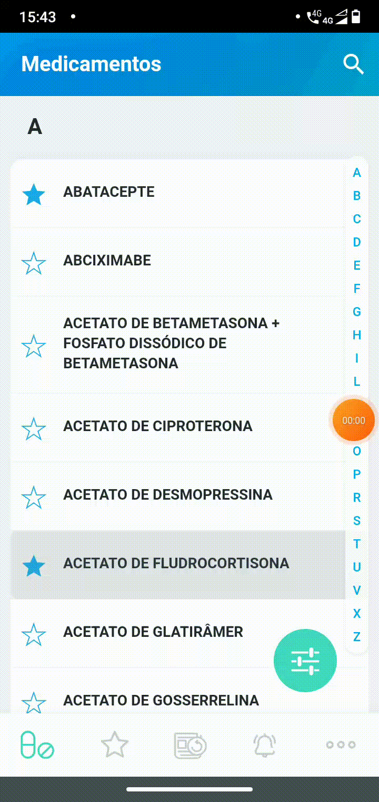
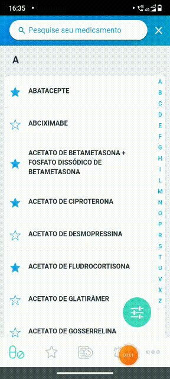
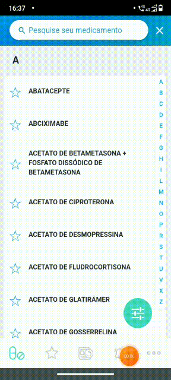

## 1. Introdução

Existem dois tipos de rastreabilidade Forward: Forward-to e Forward-from. Os dois rastreiam de um componente upstream para artefatos downstream, a diferença está onde cada um começa. Este documento trata da rastreabilidade Forward From, a qual rastreia relacionamentos entre requerimentos e artefatos downstream correspondentes, incluindo casos de teste. Esse tipo de rastreamento garante que cada requerimento, além de satisfeito, foi verificado e validado.

## 2. Metodologia

Visto os artefatos construídos até agora, foi possível elaborar uma Matriz de Rastreabilidade para conectar os Requisitos, Épicos, Features, História de Usuário e Funcionalidade.

Como o MedSUS não é um software de código aberto, não foi possível relacionar o código-fonte aos requisitos.

## 3. Pré-Rastreabilidade

### 3.1. Matriz de Rastreabilidade

**Legenda:**

- R: Requisito
- ST: Storytelling
- IR: Requisito de Introspecção

| ID   | Requisito                                                                                                                |
| ---- | ------------------------------------------------------------------------------------------------------------------------ |
| R08  | O usuário deve ser capaz de alterar informações baseado no perfil de usuário (Profissional de saúde/Usuário comum).      |
| ST19 | A aplicação deve disponibilizar o aumento (e redução) do tamanho da fonte das monografias.                               |
| IR3  | Acessar partes específicas da bula através de um índice.                                                                 |
| R03  | O usuário deve ser capaz de favoritar medicamentos.                                                                      |
| R12  | O usuário deve conseguir buscar palavras-chave no texto das informações.                                                 |
| R04  | O usuário deve ser capaz de filtrar por Grupo Anatômico Principal.                                                       |
| R05  | O usuário deve ser capaz de filtrar por anexo da Rename.                                                                 |
| R06  | O usuário deve ser capaz de filtrar por controle especial.                                                               |
| R07  | O usuário deve ser capaz de filtrar por medicamentos que possuem genérico ou não.                                        |
| ST17 | O app deve notificar os usuários acerca das atualizações da monografia dos medicamentos (inclusão, remoção e alteração). |
| ST08 | O app deve gerar arquivos para compartilhar com qualquer outra pessoa.                                                   |
| IR10 | Compartilhar informações por PDF.                                                                                        |

### 3.2. Especificações

<!-- **R08**

|         R08         | O usuário deve ser capaz de alterar informações baseado no perfil de usuário (Profissional de saúde/Usuário comum). |
| :-----------------: | :-----------------------------------------------------------------------------------------------------------------: |
|        Épico        |                                                    Visualização                                                     |
|       Feature       |                                                   Alterar Perfil                                                    |
| História de Usuário |                 [US01](https://requisitos-de-software.github.io/2021.2-MedSUS/modeling/userstory/)                  |
|   Funcionalidade    |                                                                                                                     |

**ST19**

|        ST19         | A aplicação deve disponibilizar o aumento (e redução) do tamanho da fonte das monografias |
| :-----------------: | :---------------------------------------------------------------------------------------: |
|        Épico        |                                       Visualização                                        |
|       Feature       |                                 Alterar tamanho da fonte                                  |
| História de Usuário |    [US03](https://requisitos-de-software.github.io/2021.2-MedSUS/modeling/userstory/)     |
|   Funcionalidade    |                                                                                           |

**IR3**

|         IR3         |              Acessar partes específicas da bula através de um índice.              |
| :-----------------: | :--------------------------------------------------------------------------------: |
|        Épico        |                                    Visualização                                    |
|       Feature       |                                 Apresentar índice                                  |
| História de Usuário | [US04](https://requisitos-de-software.github.io/2021.2-MedSUS/modeling/userstory/) |
|   Funcionalidade    |                                                                                    | -->

**R03**

|         R03         |                O usuário deve ser capaz de favoritar medicamentos.                 |
| :-----------------: | :--------------------------------------------------------------------------------: |
|        Épico        |                                       Filtro                                       |
|       Feature       |                                     Favoritar                                      |
| História de Usuário | [US05](https://requisitos-de-software.github.io/2021.2-MedSUS/modeling/userstory/) |
|   Funcionalidade    |               |

<!-- **R12**

|         R12         |      O usuário deve conseguir buscar palavras-chave no texto das informações.      |
| :-----------------: | :--------------------------------------------------------------------------------: |
|        Épico        |                                       Filtro                                       |
|       Feature       |                             Filtrar por Palavras-chave                             |
| História de Usuário | [US06](https://requisitos-de-software.github.io/2021.2-MedSUS/modeling/userstory/) |
|   Funcionalidade    |                                                                                    | -->

**R04**

|         R04         |         O usuário deve ser capaz de filtrar por Grupo Anatômico Principal.         |
| :-----------------: | :--------------------------------------------------------------------------------: |
|        Épico        |                                       Filtro                                       |
|       Feature       |                        Filtrar por Atributos do medicamento                        |
| História de Usuário | [US07](https://requisitos-de-software.github.io/2021.2-MedSUS/modeling/userstory/) |
|   Funcionalidade    |               |

**R05**

|         R05         |              O usuário deve ser capaz de filtrar por anexo da Rename.              |
| :-----------------: | :--------------------------------------------------------------------------------: |
|        Épico        |                                    Visualização                                    |
|       Feature       |                                   Alterar Perfil                                   |
| História de Usuário | [US09](https://requisitos-de-software.github.io/2021.2-MedSUS/modeling/userstory/) |
|   Funcionalidade    |               |

**R06**

|         R06         |             O usuário deve ser capaz de filtrar por controle especial.             |
| :-----------------: | :--------------------------------------------------------------------------------: |
|        Épico        |                                       Filtro                                       |
|       Feature       |                        Filtrar por Atributos do medicamento                        |
| História de Usuário | [US10](https://requisitos-de-software.github.io/2021.2-MedSUS/modeling/userstory/) |
|   Funcionalidade    |               |

**R07**

|         R07         | O usuário deve ser capaz de filtrar por medicamentos que possuem genérico ou não.  |
| :-----------------: | :--------------------------------------------------------------------------------: |
|        Épico        |                                       Filtro                                       |
|       Feature       |                        Filtrar por Atributos do medicamento                        |
| História de Usuário | [US11](https://requisitos-de-software.github.io/2021.2-MedSUS/modeling/userstory/) |
|   Funcionalidade    |               |

**ST17**

<!-- |        ST17         | O app deve notificar os usuários acerca das atualizações da monografia dos medicamentos (inclusão, remoção e alteração). |
| :-----------------: | :----------------------------------------------------------------------------------------------------------------------: |
|        Épico        |                                                       Notificação                                                        |
|       Feature       |                                                    Notificar usuários                                                    |
| História de Usuário |                    [US13](https://requisitos-de-software.github.io/2021.2-MedSUS/modeling/userstory/)                    |
|   Funcionalidade    |                                                                                                                          |

**ST08**

|        ST08         |       O app deve gerar arquivos para compartilhar com qualquer outra pessoa.       |
| :-----------------: | :--------------------------------------------------------------------------------: |
|        Épico        |                              Compartilhar monografias                              |
|       Feature       |                                   Alterar Perfil                                   |
| História de Usuário | [US15](https://requisitos-de-software.github.io/2021.2-MedSUS/modeling/userstory/) |
|   Funcionalidade    |                                                                                    |

**IR10**

|        IR10         |                         Compartilhar informações por PDF.                          |
| :-----------------: | :--------------------------------------------------------------------------------: |
|        Épico        |                                  Compartilhamento                                  |
|       Feature       |                              Compartilhar monografias                              |
| História de Usuário | [US16](https://requisitos-de-software.github.io/2021.2-MedSUS/modeling/userstory/) |
|   Funcionalidade    |                                                                                    |
 -->
## 4. Conclusão

## Referências bibliográficas

> SERRANO, Milene; SERRANO, Maurício. Requisitos (Aula 26): Elicitação, Modelagem e Análise. 2022. Apresentação de Power Point. 44 slides. color. Disponível em: https://aprender3.unb.br/pluginfile.php/1668237/mod_resource/content/1/Requisitos%20-%20Aula%20026.pdf. Acesso em: 03 abr. 2022.

> POHL, Klaus; RUPP, Chris. Requirements Engeneering Fundamentals: A Study Guide for the Certified Professional for Requirements Engineering Exam Foundation Level / IREB compliant. 1. ed. [S. l.]: O'Reilly Media, Inc., 2011. 183 p.

## Histórico de versões

| Versão |   Data   |              Alteração               | Responsável |  Revisão   |
| :----: | :------: | :----------------------------------: | :---------: | :--------: |
| 0.0.1  | 03/04/22 |               Criação                |  Fernando   | João Durso |
| 0.0.2  | 03/04/22 | Correções na padronização e no texto | João Durso  |  Fernando  |
| 0.0.3  | 03/04/22 |          Correção nas tabelas        | Fernando    | João Durso |
