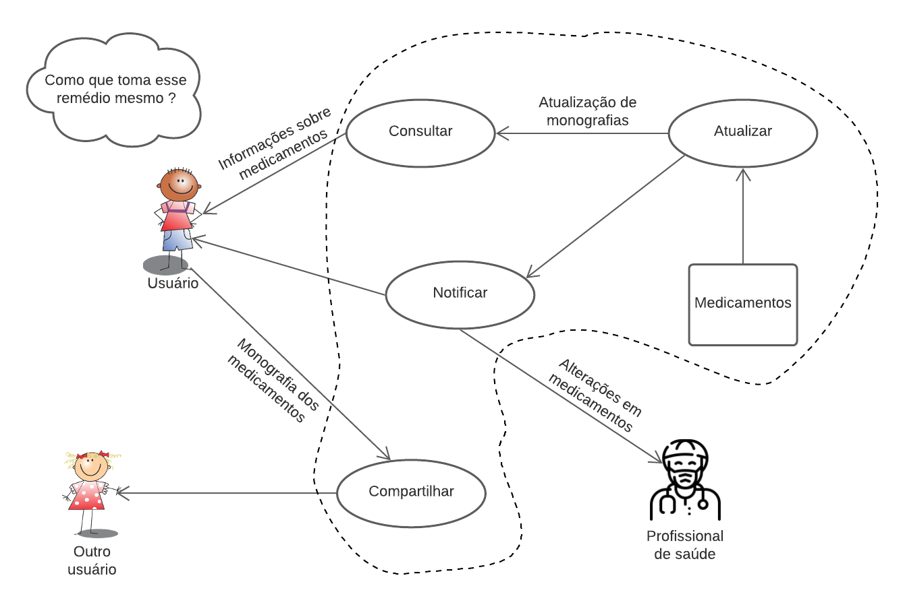
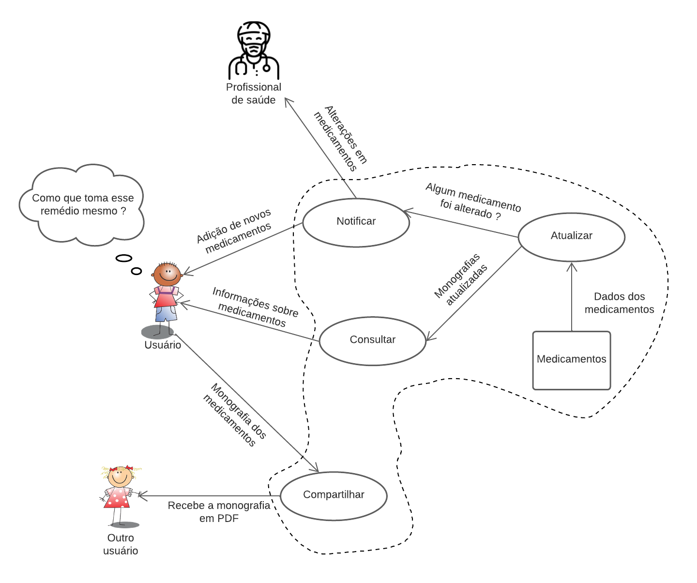

# Rich Picture

## 1. Introdução

Rich Picture é uma ferramenta visual para analisar problemas e expressar ideias,[[1]](#referencias) por meio de diagramas com imagens e símbolos. Ela pode encorajar discussões e com isso ampliar e nivelar o conhecimento da equipe. Além disso, ela também ajuda a indentificar problemas e conflitos em potencial.

## 2. Metodologia

Para a criação desse artefato fizemos uma análise das funcionalidades desejadas para o aplicativo, em seguida criamos o Rich Picture utilizando a ferramenta <i>Figma</i>. Com isso, conseguimos ilustrar os principais elementos do ecossistema da aplicação e suas relações.

## 3. Rich Pictures

### Versão 1.0

<h6 style="text-align:center">Figura 1: Versão 1.0 Rich Picture</h6>
<h6 style="text-align: center">Fonte: Autor</h6>

### Versão 2.0

<h6 style="text-align:center">Figura 2: Versão 2.0 Rich Picture</h6>
<h6 style="text-align: center">Fonte: Autor</h6>

## Versionamento

| Versão |    Data    |                 Alteração                 | Responsável |  Revisão   |
| :----: | :--------: | :---------------------------------------: | :---------: | :--------: |
| 0.0.1  | 30/01/2022 |            Criação do arquivo             |  Thalisson  | João Durso |
| 0.0.2  | 30/01/2022 | Adição da primeira versão da Rich Picture |  Thalisson  | João Durso |
| 0.0.3  | 03/04/2022 | Adição da segunda versão da Rich Picture  |  Thalisson  | João Durso |
| 0.0.4  | 03/04/2022 | Correção textual e adição de metodologia  | João Durso  | Thalisson  |
| 0.0.5  | 19/04/2022 |           Adição da metodologia           |  Thalisson  | João Durso |

## Referências

> REVADI, Chindy. Rich Picture Drawing Guidelines: Introducing Rich Pictures. Leicester: De Montfort University, 2018.
