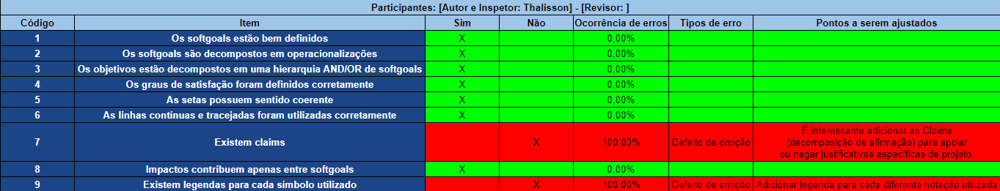
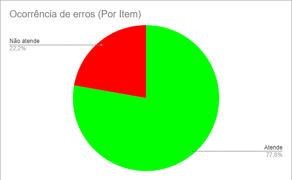

# Inspeção (NFR Framework)

    

        

            

                
                <figcaption>Fonte: iStock</figcaption>
            

        

    

## 1. Introdução

A inspeção do <a href="https://requisitos-de-software.github.io/2021.2-MedSUS/modeling/nfr/">NFR</a> Framework possibilita verificar os requisitos não funcionais, suas softgoals, objetivos e as relações entre eles. Ainda conseguimos verificar questões que auxiliam o projeto, como a rastreabilidade.

## 2. Metodologia

Para a realização das verificações, é desejável que o autor do artefato não realize a inspeção do mesmo, selecionando outros membros da equipe para a tarefa. Para a inspeção do NFR tratado neste documento, a equipe escolheu o Thalisson para desenvolvê-la e o João Durso para revisá-la.

## 3. Inspeção (NFR Framework)

### 3.1 Detecção de Defeitos

Para a detecção de defeitos, elaborou-se um checklist, utilizando o Google Planilhas. As imagens abaixo apresentam o resultado da inspeção.

    

        

            
            <figcaption>Figura 1: Versão 1.0 - Checklist</figcaption>
            <figcaption>Fonte: Autor</figcaption>
        

    

    

        

            
            <figcaption>Figura 2: Versão 1.0 - Ocorrência de Itens com erros </figcaption>
            <figcaption>Fonte: Autor</figcaption>
        

    

## Referências bibliográficas

> SERRANO, Milene; SERRANO, Maurício. Requisitos (Aula 23): Elicitação, Modelagem e Análise. 2022. Apresentação de Power Point. 52 slides. color. Disponível em: https://aprender3.unb.br/pluginfile.php/1668221/mod_resource/content/2/Requisitos%20-%20Aula%20023.pdf. Acesso em: 22 mar. 2022.

> Enhancing Data Warehouse Design with the NFR Framework. Disponível em: http://www.inf.puc-rio.br/wer02/zip/Enhancing_Data(4).pdf. Acesso em: 23/03/22

## Histórico de versões

| Versão |   Data   |        Alteração        | Responsável |  Revisão   |
| :----: | :------: | :---------------------: | :---------: | :--------: |
| 0.0.1  | 23/03/22 |         Criação         |  Thalisson  | João Durso |
| 0.0.2  | 23/03/22 |  Adição da introdução   |  Thalisson  | João Durso |
| 0.0.3  | 23/03/22 |  Adição da metodologia  |  Thalisson  | João Durso |
| 0.0.3  | 23/03/22 |   Adição da Inspeção    |  Thalisson  | João Durso |
| 0.0.4  | 02/04/22 | Ajustes de padronização |  Thalisson  | João Durso |
| 0.0.5  | 02/04/22 |   Correções textuais    | João Durso  | Thalisson  |
| 0.0.6  | 19/04/22 |    Correção textual     | João Durso  | Thalisson  |
