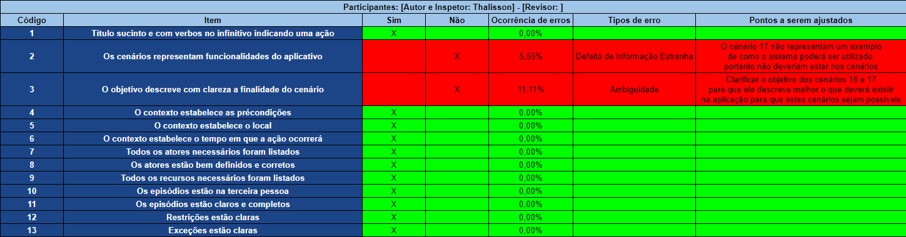
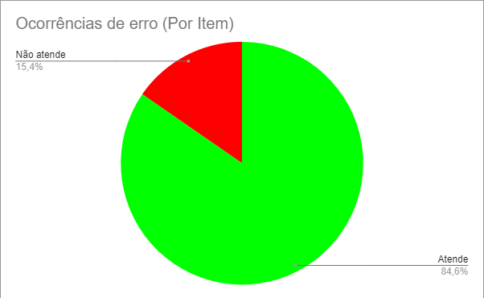

# Inspeção (Cenários)

    

        

            

                
                <figcaption>Fonte: iStock</figcaption>
            

        

    

## 1. Introdução

A inspeção dos <a href="https://requisitos-de-software.github.io/2021.2-MedSUS/modeling/scenarios/">Cenários</a> possibilita verificar as possíveis formas de se utilizar a aplicação, com a finalidade de encontrar possíveis defeitos para que eles sejam corrigidos e fiquem mais coerentes com o artefato. Ainda conseguimos verificar questões que auxiliam o projeto, como a rastreabilidade.

## 2. Metodologia

Para a realização das verificações, é desejável que o autor do artefato não realize a inspeção do mesmo, selecionando outros membros da equipe para a tarefa. Para a inspeção dos Cenários tratado neste documento, a equipe escolheu o Thalisson para desenvolvê-la e o Adrian para revisá-la.

## 3. Inspeção (Cenários)

### 3.1 Detecção de Defeitos

Para a detecção de defeitos, elaborou-se um checklist, utilizando o Google Planilhas. As imagens abaixo apresentam o resultado da inspeção.

    

        

            
            <figcaption>Figura 1: Versão 1.0 - Checklist</figcaption>
            <figcaption>Fonte: Autor</figcaption>
        

    

    

        

            
            <figcaption>Figura 2: Versão 1.0 - Ocorrência de Itens com erros </figcaption>
            <figcaption>Fonte: Autor</figcaption>
        

    

### 3.2. Correção de Defeitos

Os autores envolvidos nos Cenários são responsáveis pela remoção de todos os problemas detectados nos Cenários. O objetivo desta fase é garantir que os defeitos de requisitos identificados tenham sido eliminados.

### 3.3. Acompanhamento

A fim de garantir que as modificações necessárias nos Cenários foram feitas em conformidade, o autor e o inspetor são responsáveis por isso. O objetivo do processo de acompanhamento é garantir que o(s) autor(es) dos Cenários tenha(m) retificado todos os requisitos declarados incompletos e/ou inconsistentes ou os defeitos detectados.

- [ ] - Cenários Corrigido

## Referências bibliográficas

> SERRANO, Milene; SERRANO, Maurício. Requisitos (Aula 23): Elicitação, Modelagem e Análise. 2022. Apresentação de Power Point. 52 slides. color. Disponível em: https://aprender3.unb.br/pluginfile.php/1668221/mod_resource/content/2/Requisitos%20-%20Aula%20023.pdf. Acesso em: 22 mar. 2022.

## Histórico de versões

| Versão |   Data   |        Alteração        | Responsável |  Revisão  |
| :----: | :------: | :---------------------: | :---------: | :-------: |
| 0.0.1  | 23/03/22 |         Criação         |  Thalisson  |  Adrian   |
| 0.0.2  | 23/03/22 |  Adição da introdução   |  Thalisson  |  Adrian   |
| 0.0.3  | 23/03/22 |  Adição da metodologia  |  Thalisson  |  Adrian   |
| 0.0.4  | 23/03/22 |   Adição da Inspeção    |  Thalisson  |  Adrian   |
| 0.0.5  | 02/04/22 | Ajustes de padronização |  Thalisson  |  Adrian   |
| 0.0.6  | 19/04/22 |    Correção textual     | João Durso  | Thalisson |
