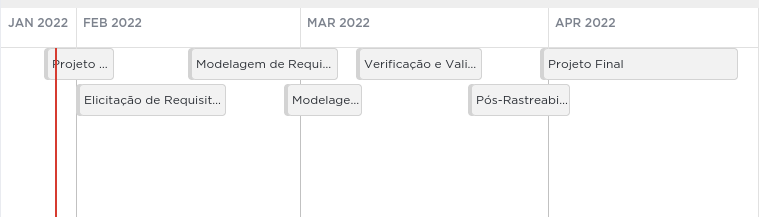

# Planejamento

## Cronograma

O cronograma foi orientado pelas próprias entregas da disciplinas e constará. Na sprint dedica a cada atividade colocaremos os responsáveis pelas issues e seus respectivos revisores. O cronograma poderá ser modificado ao longo do projeto pois artefatos podem ser evoluídos e modificados e novos contextos podem surgir.

**Clique [aqui](https://sharing.clickup.com/tl/h/6-168993937-16/759abf0db6a9492) para ver o quadro totalmente**